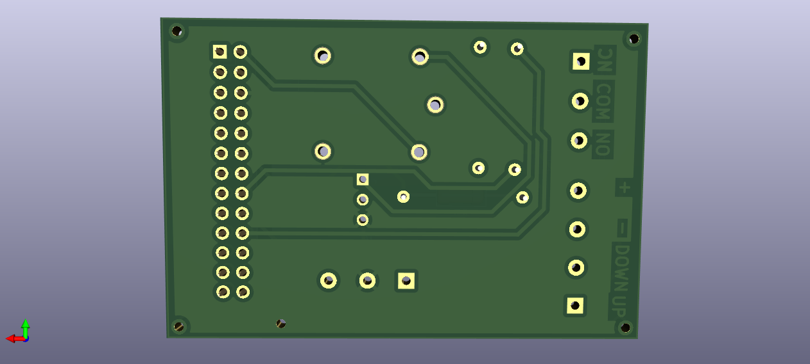

# Raspberry Pi Kart Okuma ve Video Oynatma Projesi

Bu proje, Raspberry Pi kullanarak bir kart okuma cihazı USB içinde money.txt klasöründeki int değeri kadar algılandığında USB üzerindeki bir videoyu oynatmayı ve bir fanın çalışmasını kontrol etmeyi amaçlar. Bu README dosyası, projenin nasıl kurulacağı, yapılandırılacağı ve kullanılacağı hakkında temel bilgileri içerir.

## Raspberry Pi için Gereksinimler

Bu projeyi başlatmak için aşağıdaki bileşenlere ihtiyacınız olacak:

- Raspberry Pi (örneğin, Raspberry Pi 3 veya Raspberry Pi 4)
- Kart Okuyucu (USB)
- Fan
- Röle modülü veya sürücü devreleri
- Python 3.7

## Kurulum

1. Raspberry Pi'nizi ağa bağlayın ve gerekli güncellemeleri yapmak için bir terminal açın:

   ```shell
   sudo apt update
   sudo apt upgrade

2. Main.py dosyasını Raspberry Pi'nize yükleyin. 

3. Eğer Raspberry pi'nızda otomatik başlatmak istiyorsanız AutoStart klasöründeki dosyayı inceleyebilirsiniz.

4. Usb'nizin içine yüklemek istediğiniz dosyaları first.mp4 ve second.mp4 şeklinde atın.


## Raspberry Pi PCB için Gereksinimler

- PCB dosyası Raspberry pi 1B için tasarlanmıştır.


##                                                FOR ENGLİSH

## Raspberry Pi Card Reading and Video Playback Project
 This project aims to use a Raspberry Pi to read a card reader device plugged into a USB port and, when an integer value is detected in the money.txt folder on the USB, play a video from the USB and control the operation of a fan. This README file contains basic information on how to set up, configure, and use the project.

## Requirements for Raspberry Pi
- To start this project, you will need the following components:

## Raspberry Pi (e.g., Raspberry Pi 3 or Raspberry Pi 4)
- Card Reader (USB)
- Fan
- Relay module or driver circuits
- Python 3.7
- Installation

1. Connect your Raspberry Pi to the network and open a terminal to perform the necessary updates:

   ```shell
   sudo apt update
   sudo apt upgrade

2. Upload the Main.py file to your Raspberry Pi.

3. If you want to auto-start the project on your Raspberry Pi, you can review the file in the AutoStart folder.

4. Place the files you want to load into your USB as first.mp4, second.mp4, and money.txt.

## Requirements for Raspberry Pi PCB
- The PCB file is designed for Raspberry Pi 1B.
- KiCAD 7.0 was used for design.
- The required footprints and schematics are available in the "Rp_project_requirements" file.


