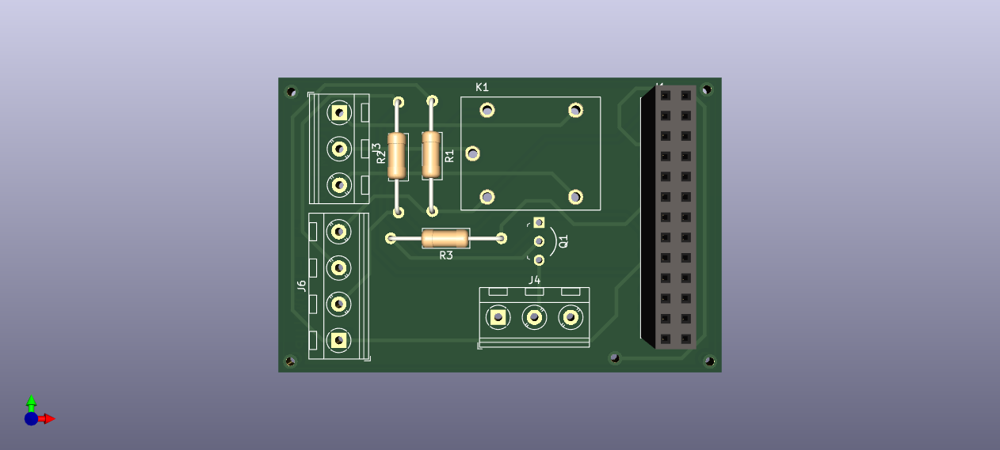

# Raspberry Pi Kart Okuma ve Video Oynatma Projesi

Bu proje, Raspberry Pi kullanarak bir kart okuma cihazı USB içinde money.txt klasöründeki int değeri kadar algılandığında USB üzerindeki bir videoyu oynatmayı ve bir fanın çalışmasını kontrol etmeyi amaçlar. Bu README dosyası, projenin nasıl kurulacağı, yapılandırılacağı ve kullanılacağı hakkında temel bilgileri içerir.

## Raspberry Pi için Gereksinimler

Bu projeyi başlatmak için aşağıdaki bileşenlere ihtiyacınız olacak:

- Raspberry Pi (örneğin, Raspberry Pi 3 veya Raspberry Pi 4)
- Kart Okuyucu (USB)
- Fan
- Röle modülü veya sürücü devreleri
- Python 3.7

## Kurulum

1. Raspberry Pi'nizi ağa bağlayın ve gerekli güncellemeleri yapmak için bir terminal açın:

   ```shell
   sudo apt update
   sudo apt upgrade

2. Main.py dosyasını Raspberry Pi'nize yükleyin. 

3. Eğer Raspberry pi'nızda otomatik başlatmak istiyorsanız AutoStart klasöründeki dosyayı inceleyebilirsiniz.

4. Usb'nizin içine yüklemek istediğiniz dosyaları first.mp4, second.mp4 ve money.txt şeklinde atın.


## Raspberry Pi PCB için Gereksinimler

- PCB dosyası Raspberry pi 1B için tasarlanmıştır.
- KICAD 7.0 kullanılmıştır.
- Gerekli olan footprint ve schematicler "Rp_project_reguirements" dosyasında yüklenmiştir.





